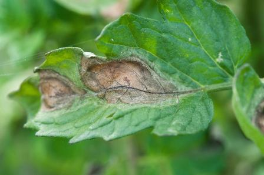

# 智农卫士：基于 MiniGPT-v2 的作物病害视觉诊断平台

一个面向作物叶片、茎秆和果实图像的中文视觉问答网页。项目基于 MiniGPT-v2，并针对作物病害场景加载 LoRA 与视觉投影微调权重。

仓库已经包含完整网页、推理代码、配置、环境定义、启动脚本和 8 张作物示例图。由于体积和许可证限制，模型权重不提交到 Git；使用者只需按说明放置权重，然后执行一条环境安装命令和一条启动命令。

> 本项目仅用于科研、教学和辅助研判，不能替代农技人员的现场诊断或农药标签要求。

## 功能

- 全中文作物病害诊断界面
- 支持上传作物图片并连续追问
- 健康诊断、症状分析、病因研判、防治建议和作物识别模式
- 8 个内置真实作物示例，不依赖仓库外部数据集
- 自动识别并加载 Linear 或 MLP 视觉投影权重
- 校验 LoRA rank 和关键权重，避免静默漏载
- 英文回答通过本地翻译模型转换为简体中文
- 模型全部本地加载，权重准备完成后可离线推理

## 页面示例

| 番茄晚疫病 | 苹果雪松锈病 | 水稻稻瘟病 | 健康甜椒 |
| --- | --- | --- | --- |
|  |  |  |  |

## 运行要求

- Windows 10/11 或常见 Linux 发行版
- NVIDIA GPU，建议显存不少于 12 GB
- 支持 CUDA 11.8 的 NVIDIA 驱动
- 建议内存不少于 24 GB
- Miniconda 或 Anaconda
- Git LFS，用于下载 Hugging Face 大模型

项目已在 Python 3.9、PyTorch 2.6.0 + CUDA 11.8 环境验证。

## 快速开始

### 1. 克隆项目

```bash
git clone https://github.com/Habit130/MiniGPT-4.git
cd MiniGPT-4
```

### 2. 放置模型权重

最终目录必须如下：

```text
MiniGPT-4/
└── models/
    ├── checkpoint_0.pth
    ├── eva_vit_g.pth
    ├── vicuna-7b/
    │   ├── config.json
    │   ├── tokenizer.model
    │   └── ...
    └── opus-mt-en-zh/
        ├── config.json
        ├── source.spm
        ├── target.spm
        └── ...
```

下载两个 Hugging Face 模型：

```bash
git lfs install
git clone https://huggingface.co/Vision-CAIR/vicuna-7b models/vicuna-7b
git clone https://huggingface.co/Helsinki-NLP/opus-mt-en-zh models/opus-mt-en-zh
```

下载 EVA ViT-G：

Windows PowerShell：

```powershell
Invoke-WebRequest "https://storage.googleapis.com/sfr-vision-language-research/LAVIS/models/BLIP2/eva_vit_g.pth" -OutFile "models/eva_vit_g.pth"
```

Linux：

```bash
curl -L "https://storage.googleapis.com/sfr-vision-language-research/LAVIS/models/BLIP2/eva_vit_g.pth" -o models/eva_vit_g.pth
```

最后将本项目训练得到的 `checkpoint_0.pth` 放入 `models/`。更详细的说明见 [models/README.md](models/README.md)。

### 3. 一条命令构建环境

Windows PowerShell：

```powershell
powershell -ExecutionPolicy Bypass -File .\scripts\setup_env.ps1
```

Linux：

```bash
bash scripts/setup_env.sh
```

脚本会创建名为 `minigpt-crop` 的 Conda 环境，并在安装后验证 PyTorch、CUDA 和核心依赖。

### 4. 一条命令启动网页

Windows PowerShell：

```powershell
powershell -ExecutionPolicy Bypass -File .\scripts\start_web.ps1
```

Linux：

```bash
bash scripts/start_web.sh
```

模型通常需要 1-3 分钟加载。启动成功后浏览器会自动打开：

```text
http://127.0.0.1:7861/
```

按 `Ctrl+C` 停止服务。

## 启动参数

Windows 示例：

```powershell
# 使用第 1 张 GPU，并改用 8080 端口
powershell -ExecutionPolicy Bypass -File .\scripts\start_web.ps1 -GpuId 1 -Port 8080

# 允许局域网设备访问
powershell -ExecutionPolicy Bypass -File .\scripts\start_web.ps1 -ServerName 0.0.0.0

# 不自动打开浏览器
powershell -ExecutionPolicy Bypass -File .\scripts\start_web.ps1 -NoBrowser
```

Linux 可通过环境变量配置：

```bash
MINIGPT_GPU_ID=1 MINIGPT_PORT=8080 MINIGPT_SERVER_NAME=0.0.0.0 bash scripts/start_web.sh
```

也可以直接运行 Python：

```bash
conda run -n minigpt-crop --no-capture-output python -u demo_v2.py \
  --cfg-path eval_configs/minigptv2_checkpoint_0_eval.yaml \
  --gpu-id 0 \
  --server-name 127.0.0.1 \
  --server-port 7861 \
  --inbrowser
```

## 项目结构

```text
.
├── assets/examples/                 # 网页内置作物示例
├── eval_configs/
│   └── minigptv2_checkpoint_0_eval.yaml
├── minigpt4/
│   └── models/projection.py         # 投影层和权重兼容逻辑
├── models/                          # 用户放置模型权重，不提交到 Git
├── scripts/
│   ├── setup_env.ps1
│   ├── setup_env.sh
│   ├── start_web.ps1
│   └── start_web.sh
├── tests/test_projection.py
├── demo_v2.py                       # 中文 Gradio 网页入口
└── environment.yml
```

## 验证

运行投影层与权重兼容测试：

```bash
conda run -n minigpt-crop python tests/test_projection.py -v
```

快速检查关键 Python 文件：

```bash
conda run -n minigpt-crop python -m py_compile demo_v2.py minigpt4/models/projection.py minigpt4/models/minigpt_v2.py
```

## 常见问题

### 提示缺少模型文件

启动脚本会检查四类模型。请确认文件名、目录层级与 [models/README.md](models/README.md) 完全一致，不要多嵌套一层 Hugging Face 仓库目录。

### CUDA 不可用

先执行：

```bash
conda run -n minigpt-crop python -c "import torch; print(torch.cuda.is_available(), torch.version.cuda)"
```

若输出 `False`，请检查 NVIDIA 驱动是否支持 CUDA 11.8，并确认没有安装 CPU 版 PyTorch。

### 显存不足

关闭其他占用 GPU 的程序，保持 `low_resource: true`，或使用显存更大的 NVIDIA GPU。本项目默认以 8-bit 方式加载 Vicuna 7B。

### 页面能打开但示例图不显示

确认 `assets/examples/` 中的 8 张 JPG 文件完整存在。项目不再读取外部 `dataset` 目录。

## 模型与数据说明

- `checkpoint_0.pth` 是作物病害任务微调权重，不包含 Vicuna、EVA ViT-G 或翻译模型的完整参数。
- 示例图片清单与原始类别见 [assets/examples/README.md](assets/examples/README.md)。
- 发布者和使用者应分别确认基础模型、微调权重及图片数据的许可证允许其使用和分发。
- 请勿将 `models/` 中的权重直接提交到普通 Git 仓库。

## 致谢

本项目基于以下开源工作：

- [MiniGPT-4 / MiniGPT-v2](https://github.com/Vision-CAIR/MiniGPT-4)
- [BLIP-2](https://huggingface.co/docs/transformers/model_doc/blip-2)
- [Vicuna](https://github.com/lm-sys/FastChat)
- [LLaMA](https://github.com/facebookresearch/llama)
- [Helsinki-NLP OPUS-MT](https://huggingface.co/Helsinki-NLP/opus-mt-en-zh)

MiniGPT-v2 论文：

```bibtex
@article{chen2023minigptv2,
  title={MiniGPT-v2: Large Language Model as a Unified Interface for Vision-Language Multi-task Learning},
  author={Chen, Jun and Zhu, Deyao and Shen, Xiaoqian and Li, Xiang and Liu, Zechun and Zhang, Pengchuan and Krishnamoorthi, Raghuraman and Chandra, Vikas and Xiong, Yunyang and Elhoseiny, Mohamed},
  journal={arXiv preprint arXiv:2310.09478},
  year={2023}
}
```

## 许可证

代码沿用仓库中的 [LICENSE.md](LICENSE.md) 和 [LICENSE_Lavis.md](LICENSE_Lavis.md)。模型权重与数据资源适用各自许可证。
